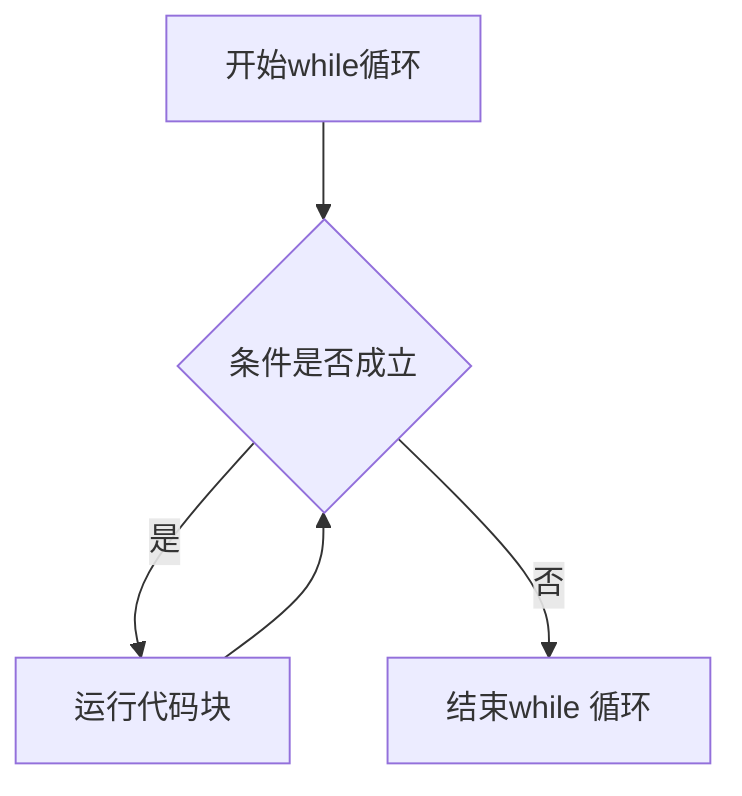

# C语言

## 前言

为什么要写这个教程？

现在无论是网上的还是纸质的计算机教程数不胜数，但是绝大部分都有一个问题：对初学者不友好。它们很少从“为什么”开始讲起，而是直接从“怎么做”开始。这会导致很多初学者学完之后就一头雾水，只会照着别人一点一点写，没有自己独到的理解。

还有一个问题就是视频教程过于冗长的问题。有的东西，几句话或者一段文字就能讲清楚的，视频作者通常要花远超这个的时间讲完，因此即使能看完，效率也是不高的。我不喜欢看到这些低效的视频。

我希望我的教程能解决这两个问题，也算是完成我之前对于写教程的想法以及对上述问题的想法。

## 第一章 计算机

### 一、计算机的核心

计算机是什么？顾名思义，**计算机**（Computer）就是进行**计算**（Compute）的**机器**（-er）。

思考一个计算的过程，我们可以发现，它有两大组成部分：**算什么**（计算对象）和**怎么算**（计算方式）。

- 算什么：不难理解，就是**数**（$1$、$2$、$3$等）与**代数**（$x$、$y$、$z$等）。

- 怎么算：也不难理解，就是$+$、$-$、$\times$、$\div$等。

对于计算机而言，只要解决这两个问题，就完成了它的使命——计算。

### 二、计算机的组成

现代计算机的组成，都满足“冯诺依曼架构”，其规定计算机有五大组成部分。

根据上文，可以很容易想到其中两个：**存储器**（算什么，即存储计算数据的部分）和**运算器**（怎么算，即实现计算的部分）。

还有三个组成部分是什么？

- 首先，为了操控运算器、存储器以及它们之间的数据传递过程，我们需要一个“**控制器**”来实现这些功能。
- 其次，计算机作为工具，其最终目的还是为人服务。因此为了人和计算机能够**交互**，还需要“**输入设备**”和“**输出设备**”。

综上就是冯诺依曼架构的五大组成部分：运算器、存储器、控制器、输入设备、输出设备。

### 三、计算的实现原理

#### 1. 存储器

在计算机的电路中，有两种信号：高电压（记为$1$）和低电压（记为$0$）。

假设我们同时有8个这样的信号，根据计数原理，我们可以表示出 $2^8 = 256$ 种值（即 $00000000$ ～ $11111111$ ）。因此我们可以将我们平时用的数字，通过一一对应的方式，把它表示成由若干个由1和0的信号的组成。这种计数方式就称为**二进制**（binary）。其中每一个信号为一个**位**（bit），八个位为一个**字节**（Byte）

为了能让计算机通过二进制的方式存储并处理各类数据（数字、文本、图片等），我们需要对它们“**编码**”（Encode），并且编码的反过程叫“**解码**”（Decode）。下面是几个编码的例子：

- 为了存储正整数和负整数，我们将若干个位的第一个位用来标记正负，剩余的位存储数值

- 对于文本，我们让每一个字符都有一个独立的编号（数值）[^1]，比如a为1，b为2，以此类推。所有字符与数值的对应关系组成的集合称为“**字符集**”（Charset）。流行的字符集有ASCII、GBK（或GB2312）、UTF-8等。

[^1]: 就好比一个班，每个人都有学号，这个学号就相当于是对学生的编码

存储器在软件层面称为“**内存**”（Memory）。在内存中，每个数据存储的位置叫做“**地址**”（Address）。

#### 2. 运算器

上文讲到了0和1两种信号，为了实现加减乘除等，我们先从最基本的三个运算开始：**与**（And）、**或**（Or）、**非**（Not）。

- A 与 B：若 A=1 且 B=1，则 A与B = 1，否则为0
- A 或 B：若 A=1 或 B=1，则 A或B = 1，否则为0

- 非 A：将A的值取反（如1取反为0，0取反为1）

这三种运算都有对应的硬件层面的实现，统称为“逻辑门”（Logical Gates），如”与门“实现与运算，”或门“实现或运算，”非门“实现非运算。

通过对这三种逻辑门的组合，计算机可以实现加减乘除以及数据存储。由于篇幅限制，详情请见：[【计算机科学速成课】[40集全/精校] - Crash Course Computer Science](https://www.bilibili.com/video/BV1EW411u7th)

## 第二章 编程基础

### 一、变量

在计算机中，我们通过“**变量**”（Variable）存储数据。数据有自己的类型，那么对应的变量也有自己的类型，我们将其称为“变量类型”（Variable Type）。常见的变量类型有：

- 整数（Integer）
- 实数/小数（Decimal）
- 字符（Character）
- ……

### 二、运算

计算机有四类运算：

1. 算术运算（Arithmetic operation）：加（`+`）、减（`-`）、乘（`*`）、除（`/`）、取余[^2]（`%`）
2. 关系运算（Relational operations）：大于（`>`）、大于等于（`>=`）、小于（`<`）、小于等于（`<=`）、等于（`==`）、不等于（`!=`）
3. 逻辑运算（Logical operations）：与（`&&`）、或（`||`）、非（`!`）
4. 位运算（Binary operations）：与（`&`）、或（`|`）、非（`!`）、异或（`^`）、取反（`~`）、左移（`<<`）、右移（`>>`）

[^2]: 指得到除以一个数后的余数

### 三、函数

在数学中，我们见到的函数一般是这样的形式：$f(x) = 3x^2 - x + 2$。

在计算机中，**函数**（Function）有一些变化：

1. 函数可以没有参数，也可以有很多个参数
2. 函数的每个参数都必须有特定类型，函数的结果也必须有特定类型
3. 在一个函数内，执行的运算/操作可以非常多
4. 函数的结果不一定体现在得出某个具体数值，还可以体现在对外界产生某些影响（比如在屏幕上显示文本）

### 四、算法

**算法**（Algorithm）指的是用计算机解决问题的一系列步骤。算法的表示方式有：

- 自然语言：即人类交流使用的语言
- 流程图（Flow Chart）：如下图


- 伪代码（PseudoCode）：[维基百科](https://zh.wikipedia.org/wiki/%E4%BC%AA%E4%BB%A3%E7%A0%81)
- 编程语言（Programming Language）：能直接或间接被计算机执行的一系列指令/代码。用编程语言写成的指令称为**代码**（Code）。所谓“编程”，即编写**程序**（Program）。一个程序就是计算机需要执行的代码的一个集合。

可以说，算法是一个计算机程序的灵魂，算法决定了计算机怎么算，也决定了一个程序的核心目的。

算法还有以下特征：

1. 输入（Input）：一个算法必须有零个及以上的输入。
2. 输出（Output）：一个算法必须有一个及以上的输出。
3. 明确性：算法的描述必须无歧义。
4. 有限性：一个算法的步骤的数量必须是有限的。
5. 可行性：算法能够被计算机实现。

## 第三章 C语言

### 一、编程语言

在上文中我们了解到了编程语言，它就像“语言”一样让我们能和计算机“沟通”，即让计算机执行我们想要的计算和指令。编程语言分几种类型：

- 机器语言（Machine Code）：计算机可以直接理解的二进制指令
- 汇编语言（Assembly Language）：机器语言的文本形式
- 高级语言（High-Level Programming Language）：将汇编语言进行高度封装，易于一般人接受的编程语言

我们将要学习的C语言，属于高级语言。

由于高级语言不是二进制指令，计算机无法直接执行，因此我们可以通过以下两种方式让计算机执行：

1. 编译执行（Compile & Run）：先通过**编译器**（Compiler）将代码**编译**（Compile）[^3]成**可执行文件**（Executable File），再让计算机执行。
2. 解释执行（Interpret & Run）：通过已有的程序，将代码作为程序的输入，让该程序解析代码的内容再执行。

[^3]: 指将代码变为二进制指令

在高级语言中，两种方式分别对应“编译型语言”（Compiled Language）和“解释型语言”（Interpreted Language）。C语言属于前者。

### 二、变量与运算

#### 1. 变量

在C语言中，变量有以下类型（由于计算机的内存不是无限的，因此每个变量都有自己固定的大小以及存储数值的范围）：

- 整数[^4]：`short`（2Byte）, `int`（4Byte）, `long long`（8Byte），`unsigned short`（2Byte）, `unsigned int`（4Byte）, `unsigned long long`（8Byte）
- 浮点数（即小数）：`float`（4Byte）, `double`（8Byte）
- 字符[^5]：`char`（1Byte）
- 字符串（由若干个字符组成，相当于一段文本）：`char[]`或`char*`（由于字符数量不固定，因此大小也不固定）

[^4]: 前三种类型只有大小和存储范围的区别；后三种相比前三种，在前面多了一个`unsigned`，意思是“无符号”，即不标记整数的正负，因此只能保存非负数
[^5]: 使用ASCII编码

在C语言中，要想使用变量，必须先“**声明**”（Declare）变量，即告诉计算机我即将使用这个变量，给这个变量分配内存。

声明格式：

```c
变量类型 变量名;
```

> 注：在C语言中，每一行代码后都需要接`;`（分号）。

若需要同时声明多个变量：

```c
变量类型 变量名1, 变量名2, ...;
```

>  注：变量名规则：由字母、数字和下划线（`_`）组成，且不以数字开头，且不与已有变量或“**关键字**”[^6]（Keyword）重名

[^6]: 指C语言预先定义的一些名字（如int等）

同一个变量只能被声明一次。

变量声明的位置有两种：

1. 函数内：称为“**局部变量**”（local variable），只能在该函数内部访问/使用
2. 函数外：称为“**全局变量**”（global variable），可在任何一个函数内访问/使用

> 注：变量能够被访问到的地方的总和，称为“**作用域**”（Scope）

要想修改变量的值，需要通过“**赋值**”（Assign）实现。格式：

```c
变量名 = 值;
```

声明和赋值也可以写在一起：

```c
变量类型 变量名 = 值;
```

```c
变量类型 变量名1 = 值1, 变量名2 = 值2, ...;
```

以下是C语言部分类型的赋值方式：

1. 整数

```c
int x = 1;
```

2. 浮点数

```c
float x = 0.12;
```

3. 字符

```c
char x = 'a';
```

4. 字符串（详情解释见后文字符串部分）

```c
char s1[] = "123";
char s2[10] = "123";
```

像上面这样，这些可以直接写出的值被称为“**字面量**”（Literals）。

有一些特殊字符，很难像上述方式一样表示出来（如换行符），因此我们需要通过“**转义字符**”（Escape Character）实现。转义字符顾名思义就是将部分字符转换为特定含义，其书写格式为在字符前加反斜杠`\`。例如`\n`就是将`n`变成换行符的含义。常见的转义字符还有`\t`（制表符）等。

在C语言里，我们可能会想要把一个类型的变量转换成另一个类型的变量（比如把`int x = 1`转换成`float x = 1.0`），这时就需要**强制类型转换**（Type Cast）。写法为：

```c
(新类型) 值
```

比如：

```c
int x = 1;
float y = (float) x;
```

要想获取某个变量类型在内存中的长度，可以使用`sizeof`关键字：

```c
sizeof(类型)
```

比如：

```c
unsigned long long x = sizeof(int); // 单位为字节
```

#### 2. 运算

运算有下面几种：

1. 算术运算：

```c
int x = 3, y = 5, z;
z = x + y;
z = x - y;
z = x * y;
z = x / y;
z = x % y;
```

需要特别注意的是：

- 对于乘除，如果符号两边都是整型，则结果也为整型，其值为舍弃小数部分的数学结果；若其中一个为浮点型，则结果就为浮点型。
- 对于取余（%），一般情况下，符号两边都是自然数。

2. 自增/减运算

自增/减，顾名思义就是让变量本身的值被加减。其写法如下：

```c
int x = 0;
++x;
x++;
--x;
x--;
```

第二、三行为自增，第四、五行为自减。对于自增/自减，其在效果上等价于`x = x + 1;`和`x = x - 1;`。

`++x`/`--x`和`x++`/`x--`的区别，只会在式子中表现：前者会先进行自增运算再进行其他运算，而后者则是反过来。比如：

```c
int x = 0, y;

y = 1 + (x++);
```

y的结果为1，因为计算机会先计算`1 + x`再进行`x++`操作。

```c
int x = 0, y;

y = 1 + (++x);
```

y的结果为2，因为计算机会先进行`++x`操作，此时x变为1，再计算`1 + x`。

3. 赋值运算

赋值运算就是让变量的值在原来的基础上进行修改。比如：

```c
int x = 1;
x += 1;
x -= 1;
x *= 2;
x /= 2;
x %= 2;
```

就是让x变为原来的+1/-1/两倍/二分之一/除以2的余数。

### 三、函数

在C语言中，函数和变量一样需要声明。声明函数遵循以下格式：(“返回类型”指函数返回的结果的类型)

```c
返回类型 函数名(参数类型1 参数名1, 参数类型1 参数名2, ...);
```

声明函数后，需要**实现**（Implement）函数，否则将无法通过编译。格式：

```c
返回类型 函数名(参数类型1 参数名1, 参数类型1 参数名2, ...) {
    指令1;
    指令2;
    ...
    return 结果;
}
```

> 只写实现也能达到声明的效果

若没有直接的结果，返回类型写`void`，并且`return`后直接加`;`。

函数的所有参数和参数类型的总和，称为“**参数列表**”（Parameter List）

参数列表和返回类型的总和，称为“**函数签名**”（Function Signature）

对于函数来说，执行也称为“**调用**”（Invoke/Call）。

关于函数的参数，将在后文详细解释

### 四、主函数

为了让计算机从哪里开始执行指令，我们就需要一个“**入口点**”（Entry point），让计算机从入口点开始执行代码。C语言中，入口点一般是`main()`函数，即计算机会从执行`main()`函数的代码开始。

对于`main()`函数，我们写成下面的形式：

```c
int main() {
    指令1;
    指令2;
    ...
    return 0;
}
```

> 部分解释：返回`int`，目的是告知计算机，程序是否正常结束。（一般0表示正常，非0表示不正常）

### 五、代码块与注释

#### 1. 代码块

由 `{}` 包裹的一个整体，称为“**代码块**”（Code Block）。代码块即多行代码的一个集合。代码块可以相互嵌套，即代码块中还可以出现代码块。代码块中可以声明变量，其作用域为代码块内所有范围，但不包含代码块外界，即代码块内的变量无法被代码块外访问。常见的代码块如函数的主体（实现）部分。

#### 2. 注释

编程语言虽然是我们为了和计算机交流设计的，但我们在编写程序过程中还要为人类的阅读和理解需求考虑。“**注释**”（Comments）就是为了解决这个需求而诞生的。注释在编译过程中会被忽略，即不会对结果产生任何影响。注释分为以下两种：

1. 单行注释（Single-Line Comments），格式：

```c
指令; // Comment
```

2. 多行注释（Multi-Line Comments），格式：

```c
/*
Comment1
Comment2
...
*/
```

### 六、头文件与输入输出

#### 1. 头文件

有的时候，单个C语言代码文件无法实现一定的功能，这个时候就需要来自外界代码文件的帮助，这个文件叫作“**头文件**”（Header File）。头文件一般包含有大量函数的声明[^7]，供其他代码使用。使用方式：

```c
#include <头文件名>

其余代码
```

> 注：C语言文件后缀为`.c`，头文件后缀为`.h`

[^7]: 关于其函数实现的位置，略

头文件既可以由我们自己（用户）编写，也可以直接使用C语言标准库[^8]自带的头文件。

[^8]: 标准库（Standard Library）指C语言为了方便用户开发，预先提供的一系列实现特定功能的函数等

#### 2. 输入输出

计算机早期的时代，不像现在这样有生动形象的窗口。当时和计算机交互只能在**终端**（Terminal）中进行。在终端中，用户可以执行一系列程序或**命令**（Commands），并对程序进行输入和观察其输出。现在我们看到的终端一般都是黑底白字的窗口。我们接下来的用C语言编写的程序，都需要在终端中运行。下面是C语言实现输入和输出的方式：

> 注：我们没法自己实现输入输出，但是C语言标准库已经提供了这两个功能

1. 输出：使用 `printf`函数（位于头文件`stdio.h`[^9]中）

“printf”即“print”（打印，在计算中指向终端输出内容）和“f”(formatted，格式化，即按照一定的格式输出文本信息和变量）。

使用方式：

```c
printf(格式化字符串, [变量1, [变量2, ...]]);
```

其中变量的个数不固定（0个或多个），要根据格式化字符串的内容而定。

实例1：

```c
printf("Hello, world!");
```

这样写只是单纯的输出一段文本“Hello, world!”，还没有用上格式化的功能。想要使用格式化，就需要在字符串中加入格式控制符，并在后面带上变量，如：

```c
int x = 1, y = 2;
printf("%d + %d = %d", x, y, x + y);
```

其中，`%d`表示在这个地方替换一个整型变量，其按照控制符的书写位置以及参数的填写顺序依次替换。比如这段代码就会输出：

```text
1 + 2 = 3
```

常见的格式控制符：

| 格式控制符 |       说明        |
| :--------: | :---------------: |
|   %d / %ld   | 表示int/long long |
|   %f / %lf   | 表示float/double  |
|     %c     |     表示字符      |
|     %s     |    表示字符串     |

对于浮点数（`%f`/`%lf`），还可以指定其保留小数的位数。格式为`%.?f`，`?`为位数，比如`%.2f`就是保留两位小数。

其他格式化方式详见下面两张图片：


2. 输入：使用 `scanf`函数（位于头文件`stdio.h`中）

“scanf”即“scan”（扫描，在计算中指在终端获取用户的输入）和“f”(formatted，格式化，即按照一定的格式读取用户的输入）。

`scanf`的使用方式和`printf`基本相同，只是每个变量前必须加上`&`（详细解释见后文指针部分）。scanf会根据格式化字符串和格式控制符，将用户的输入一一对照并其中的值解析出来赋值给参数列表中的变量。如：

```c
int x, y;
scanf("%d %d", &x, &y);
```

用户在终端中输入：

```text
1 2
```

就会使x的值变为1，y的值变为2。

[^9]: “stdio”即“std“ 和“io”，“standard input/output”的缩写

### 七、分支语句与逻辑表达式

在一个算法中，我们经常会遇到根据某个条件是否成立进行不同的操作，这个就被称为“**分支**”。在C语言中，实现分支的语句被称为分支语句。分支语句有两种：

#### 1. `if-else` 语句

书写格式：

```c
if (条件)
{
  代码
}
else
{
  代码
}
```

当条件成立（也称为条件为真）时，则会执行if后的代码块，否则执行else后的代码块。注意事项：

1. 若代码块内只有一句代码，则`{}`可以省略不写。
2. 若不需要`else`分支，则可以省略不写

若分支不止两条，或条件判断不止一次，则可以使用`else if`：

```c
if (条件1)
{
  代码
}
else if (条件2)
{
  代码
}
else if (条件3)
{
  代码
}
else
{
  代码
}
```

若条件1不成立，则会判断条件2，再不成立就继续往下判断，以此类推。

条件的写法见下文的逻辑运算。

#### 2. `switch` 语句

书写格式：

```c
switch (x)
{
  case 值1:
    代码;
    break;
  case 值2:
    代码;
    break;
  case 值3:
    代码;
    break;
  // ...
  default:
    代码;
    break;
}
```

`switch`会根据x的值，找到x和其中一个case的值相同的分支，并执行其中的代码。若找不到则执行default。注意事项：

1. `default`分支可以省略不写，若switch找不到匹配的case的值，就会直接退出。

2. 通常情况下，每个分支的末尾都需要写`break`，表示退出这个分支[^10]；若不写就会不顾case，继续执行后面的代码。

3. x支持的类型有且仅有：整型和字符

[^10]:也可以用`return`退出switch所在的函数，此时就不需要写`break`

#### 逻辑表达式

在数学中，我们把一个可真可假的一件事称为条件。在C语言中，条件的表示是通过逻辑表达式[^11]实现的。C语言的逻辑就是真（True）或假（False），在数值上表现为：为0就为假，不为0（一般取1作为代表）就为真。逻辑表达式就是结果要么真（1）要么假（0）的表达式。其通过下面两种运算书写：

1. 关系运算：大于（`>`）、大于等于（`>=`）、小于（`<`）、小于等于（`<=`）、等于（`==`）、不等于（`!=`）

关系运算用于判断两个变量之间的关系，满足则值为真（1），否则为假（0）

2. 逻辑运算：与（`&&`）、或（`||`）、非（`!`）

逻辑运算用于逻辑值之间的运算。其计算结果也为逻辑值。对于上面三种运算：

- `A && B`：若A为真且B真，则结果为真，否则为假。
- `A || B`：若A为真或B为真，则结果为真，否则为假。
- `!A`：若A真，则结果为假；反之亦然。

[^11]:**表达式**（Expression）意为会产生某个值的语句，比如`1 + 2`就是一个表达式

我们可以通过变量来存储逻辑表达式的值：

```c
int x = 1 < 2;
```

此时x为1（真）。

下面是一个运用分支与逻辑的代码的例子：

```c
int x = 3, y = 5;

if (x > 2 && x <= y)
{
  printf("OK\n");
}
else
{
  printf("NO\n");
}
```

易知程序输出结果为OK

### 八、数组与字符串

#### 1. 数组

目前，我们已经有能力用变量存储数值了，但是那仅限于数据量较少的情况。假如现在需要处理一万个整数，以声明一万个变量的方式实现显然不现实，因此我们需要一种能存储大量变量的方式。

在数学领域内，我们会通过数列$\{a_n\} = a_1, a_2, a_3, \dots, a_n$的方式表示一连串的数，那么在计算机里，我们有类似的方法：使用**数组**（Array）。数组是一种变量类型，其可以存储多个相同类型的数值。声明并赋值数组的方式如下：

```c
变量类型 变量名[数组长度n] = {数值1, 数值2, ..., 数值n};
```

数学中数列可以是无限数列，但计算机的内存不是无限的，不可能存在无限长度的数组，因此声明数组的时候就必须明确它的长度。

数组还有两种特别的创建方式：

1. 省略数组长度

```c
变量类型 变量名[] = {数值1, 数值2, ..., 数值n};
```

此时编译器会根据等号右边的赋值自动指定数组长度

2. 省略后续数值

```c
变量类型 变量名[数组长度n] = {数值1, 数值2, ..., 数值k}; // 0 < k < n
```

后续没有写出的数值会被自动指定成0。

特别地，数组如果不在声明时就直接赋值为`{ ... }`，那么之后将无法再使用`{ ... }`赋值。

要想使用数组中的数值，跟数列类似，需要通过下标来访问。写法为`数组名[下标]`。特别地，数组的第一个元素下标为0，第n个元素下标为$n-1$。[^12]

[^12]: 原因：考虑一个8bit的二进制整数，它可以表示$0 \sim 2^8 - 1$的数值，而非$1 \sim 2^8$。如果从1开始，那么0的位置会被浪费掉。

在C语言中，数组元素[^13]`a[i]`的使用和变量`x`完全一致。

[^13]: 数组里面的单个数我们一般称之为**元素**（Element）

在数学中，我们还学到过矩阵：
$$
\begin{bmatrix}
  a_{1,1} & a_{1,2} & a_{1,3} & \dots & a_{1,n} \\
  a_{2,1} & a_{2,2} & a_{2,3} & \dots & a_{2,n} \\
  a_{3,1} & a_{3,2} & a_{3,3} & \dots & a_{3,n} \\
  \vdots & \vdots & \vdots & & \vdots \\
  a_{m,1} & a_{m,2} & a_{m,3} & \dots & a_{m,n}
\end{bmatrix}
$$
它的下标需要用两个数表示。它可以看作是一种二维的数列，即这个数列的项都是一维的数列。

在计算机中，我们可以使用二维数组来存储这样的数据。可以把它理解为元素类型为（一维）数组的数组：

```c
int a[3][3] =
{
  {1, 2, 3},
  {4, 5, 6},
  {7, 8, 9}
};
```

可以看到第一层大括号里面包含了好几个一维数组，一维数组又包含了好几个数。

访问二维数组里面的元素也是通过下标：`a[i][j]`。

#### 2. 字符串

思考字符串的组成，比如`"Hello, world!"`，它其实是由以下字符构成的：`'H', 'e', 'l', 'l', 'o', ',', ' ', 'w', 'o', 'r', 'l', 'd', '!'`。我们可以发现字符串的本质就是字符数组。因此字符串变量的声明和数组非常相似，只是赋值时一般用`"..."`而非`{ ... }`：

```c
char 字符串名[长度] = "内容";
```

字符串的内容确定的情况下，长度也可以不写。

> 顺带一提，实际上，对于字符串（字符数组），编译器会自动给它的最后加上`\0`，用来表示字符串在这里终止。

关于字符和字符串的处理，详情内容见后文常用标准库部分。

### 九、循环语句

在数学中，我们会遇到求累和、求累积的问题。比如：
$$
\sum_{i = 1}^{n}a_i
$$
它的本质就是让下标$i$取遍$1 \sim n$的所有值，然后将每个下标对应的项加起来。

在计算机里，实现这个功能就可以通过循环执行`++i`和`sum += a[i]`实现。

下面是三种循环语句：

#### 1. while 循环

写法：

```c
while (条件)
{
	语句1;
	语句2;
	语句3;
	...
	语句n;
}
```

其过程为：



要想实现上面求和的例子，就可以这么写：

```c
int a[5] = {3, 1, 4, 2, 5};
int sum = 0;
int i = 0;

while (i < 5)
{
    sum += a[i];
    ++i;
}
```

#### 2. do-while 循环

写法：

```c
do
{
	语句1;
	语句2;
	语句3;
	...
	语句n;
} while (条件)
```

和while类似，只是开始循环的时候不是 <u>先判断条件</u> 而是 <u>先执行代码块</u>。

#### 3. for 循环

我们发现，循环执行代码块的要求是条件成立，因此每次执行代码块的时候，条件里面的某个变量必须发生了改变，否则条件将会永远成立，导致死循环。同时我们还发现很多时候这个变量是跟这个循环“同生共死”的，即循环开始前就需要创建这个变量，每次循环/条件判断都需要用到这个变量，循环结束这个变量就永远都用不到了。为了简化这个逻辑，`for`应运而生。

写法：

```c
for (初始状态语句; 条件; 变化状态语句)
{
  语句1;
	语句2;
	语句3;
	...
	语句n;
}
```

“初始状态语句”用来声明和赋值这个伴生的变量；“变化状态语句”用来修改这个伴生的变量。

`for`等价于下面的`while`：

```c
初始状态语句;

while (条件)
{
  语句1;
	语句2;
	语句3;
	...
	语句n;
  
  变化状态语句;
}
```

比如上面的求和，下标`i`就是伴生的变量，并且条件判断和状态变化都轮得到它。因此用`for`可以改写为：

```c
int a[5] = {3, 1, 4, 2, 5};
int sum = 0;

for (int i = 0; i < 5; ++i)
{
    sum += a[i];
}
```

这样循环主体的代码会更简洁清晰。

### 十、内存与指针

#### 1. 内存

我们知道，变量是用来存数据的，而存储是依赖内存实现的，因此每个变量在内存层面，存储的位置被称为地址，存的东西称为值。比如：

| 地址 |    0     |    1     |    2     |    3     | ...  |
| :--: | :------: | :------: | :------: | :------: | :--: |
|  值  | 11100101 | 10001111 | 10011011 | 01010100 | ...  |

在C语言中，对于变量`x`，`x`代表的是它的值，而`&x`代表的是它的地址[^14]。根据上表我们可以发现地址本质也是一种数值，它的类型为`unsigned long long`，即地址的长度为64位（8字节）。

[^14]: `&`被称为取地址运算符

#### 2. 指针

用于存储内存地址的变量被叫作“**指针**”（Pointer），可以把它理解为指向内存中的某一块地方的东西。其写法为：

```c
对应地址的变量类型 *变量名 = &对应地址的变量;
// 或者把“*”写到前面：
对应地址的变量类型* 变量名 = &对应地址的变量;
```

比如：

```c
int x = 0;
int *p = &x;
```

有了变量的地址之后，我们就可以自由操作这个地址所在的内存。比如：

```c
*p = 1;
```

这个时候，`x`就会变成1，因为我们通过解析指针所存储的地址来直接修改x的内存数据。

有的时候，我们不希望指针指向任何位置，这时可以将其赋值为`NULL`（即0，位于头文件`stddef.h`）。

对于一整个数组`int a[n]`，它实际上代表了内存上的一块连续区域，相当于把多个变量紧挨在一起再存储到内存中。而`a`实际上是一个指针，其指向的是数组的第一个元素（即存储了它的地址），而`a[i]`则是根据第一个元素的地址以及下标推算出第`i + 1`个元素所在地址后，解析成一个变量。也就是说，`a[i]`完全等价于`*(a + i * sizeof(int))`。

#### 3. 内存类型

创建对象必然要给它分配内存，该内存有两种类型：

- **栈内存**（Stack Memory）：声明变量时，计算机会自动为变量提供一块内存区域，并且变量用完后该内存会被自动释放[^15]。这个内存就是栈内存。
- **堆内存**（Heap Memory）：通过函数`malloc`等手动为对象分配内存，并且需要函数`free`来手动释放内存。这个内存就是堆内存。

[^15]: “释放”指该内存被操作系统收回，并在未来某个时刻分配到其他地方。

我们之前使用的所有变量，都是使用了栈内存。

对于堆内存，我们需要使用malloc和free。它们需要导入`stdlib.h`头文件。

`malloc`，即“<u>M</u>emory <u>Alloc</u>ate”（分配内存）的缩写，它需要一个参数：需要分配的内存长度（单位为字节）。它的返回结果是分配出来的内存的地址，因此我们需要通过指针来管理它：

```c
int *p = malloc(sizeof(int));
```

如果想要和一般变量一样使用它，就需要通过`*p`的方式解析地址后再使用。

变量用完后，通过`free`释放：

```c
free(p);
```

`malloc`也可以用于创建数组，但是依旧需要使用指针接收：

```c
int *p = malloc(5 * sizeof(int)); // 长度为5的int数组
```

其使用方式和数组完全一致（因为数组本质就是指针）：

```c
p[0] = 3;
p[1] = 5;
p[2] = 4;
```

栈内存和堆内存有下面的区别：

1. 栈内存是静态的，而堆内存是动态的。即栈内存在程序编译过程中，长度/大小就必须确定，但是堆内存可以动态指定长度（比如根据用户输入指定长度）。
2. 栈内存的容量上限比堆内存小得多，因此创建极长的数组（比如1'000'000个元素的数组）就不适合使用栈内存。
3. 栈内存是自动管理，但堆内存需要手动管理（创建与销毁）。
4. 相对而言，栈内存访问速度比堆内存快。

### 十一、函数的参数

#### 1. 实参与形参

对于下面的代码：

```c
void f(int x)
{
  
}

int main()
{
  int a = 3;
  
  f(a);
  
  return 0;
}
```

其中`a`就是**实际参数**（Argument），`f`参数列表中的`x`就是**形式参数**（Parameter）

调用函数的时候，实际参数的值会**复制**给形式参数，因此x和a实际上是两个完全独立的变量，在函数内修改x不会改变a的值。

#### 2. 指针作参数

由于实际参数和形式参数的“复制”特点，我们貌似无法在函数内修改外界变量的值。但是我们已经学过了指针的概念，只要有地址，就可以随时修改变量。因此我们可以将函数的参数改为指针，这样复制的就不是变量的值而是地址，就避免了这个问题。比如：

```c
void f(int *p)
{
  (*p) += 1;
}

int main()
{
  int a = 0;
  f(&a);
  return 0;
}
```

我们将`a`的地址作为参数传递，并在`f`内通过`(*p)`的方式修改这个地址所对应的内存的数据，这样就可以在函数内修改外界变量的值。

现在你就应该理解，为什么scanf里的变量，前面要加上`&`了。

#### 3. 数组作参数

写法：

```c
void f(int a[]);
void f(int *a); // 由于数组相当于指针
void f(int a[][长度][长度]...[长度]); // 多维数组写法
```

由于数组作参数时长度不确定，因此一般还需要在参数列表中加入数组的长度信息：

```c
void f(int a[], int length);
```

字符串由于末尾有`'\0'`当作截止符，所以可以不携带长度。

### 十一、结构体与枚举

#### 1. 结构体

思考下面的场景：在一场考试中，每名学生有语文、数学、英语成绩，我们如何在C语言中保存这些数据？

如果有一种变量类型Student，并且创建一个`Student a[100]`，这个问题就可以迎刃而解。

在C语言中，变量的类型也是可以由程序员自定义的，这个类型也可以存储各种数据，比如对于Student来说就是三个整数（成绩）和一个字符串（姓名）。这个自定义类型就叫做“**结构体**”（Struct）。

结构体和函数类似，需要声明和定义：

```c
// 声明
struct 名称;

// 实现
struct 名称 
{
  变量1;
  变量2;
  ...
};
```

比如对于Student来说：

```c
struct Student
{
    char *name;
    int chinese_score;
    int math_score;
    int english_score;
};
```

使用结构体也很简单：

```c
// 声明以结构体为类型的变量
struct Student student;

// 声明时赋值
// 方法1
struct Student student = {"Steve", 95, 80, 90}; // 顺序和结构体内变量声明顺序相同
// 方法2
struct Student student =
{
    .name = "Steve",
    .chinese_score = 95,
    .math_score = 80,
    .english_score = 90
};
```

要想使用结构体内的变量，只需通过`.`即可：

```c
printf("I'm %s.\n", student.name);
```

结构体变量也可以使用堆内存创建：

```c
struct Student *student = malloc(sizeof(struct Student));
free(student);
```

但此时访问结构体内的变量不再使用`.`，而是`->`：

```c
printf("I'm %s.\n", student->name);
```

#### 2. 枚举

有的时候，我们会遇到某个变量只会有有限个取值，譬如对于交通信号灯`traffic_light`，它只能取红、绿、黄三种值。这时“**枚举**”（Enumerate）就能很好地解决这个问题。枚举和结构体类似，也属于一种类型。使用方式：

```c
// 声明与定义
enum Light
{
		RED, YELLOW, GREEN // 每个值用逗号隔开
};

// 使用方式
enum Light traffic_light = RED;
```

### 十二、宏与类型别名

#### 1. 宏

**宏**（Macro）在C语言中，完成的是“替换”功能。

要创建宏：

```c
#define 宏名称 宏内容
```

对于之后的代码，所有出现这个宏的名称的地方，都会被替换为宏的内容。比如：

```c
#define PI 3.14159

float area(float radius)
{
  return PI * radius * radius;
}
```

函数中的`PI`在编译时就会被自动替换为`3.14159`。

还有一种宏，可以有参数。比如：

```c
#define SQUARED(x) ((x) * (x))

float area(float radius)
{
  return 3.14159 * SQUARED(radius);
}
```

它会根据参数的值动态替换内容。比如`SQUARED(radius)`就会被替换成`((radius) * (radius))`。

#### 2. 类型别名

顾名思义，“**类型别名**”（Type alias）就是给某个类型起一个别名。写法：

```c
typedef 原类型 别名;
```

比如：

```c
typedef struct Student Stu;
```

之后就可以使用`Stu`进行变量声明：

```c
Stu student;
```

### 十三、常用标准库

#### 1. 数学类

头文件：`math.h`

- `floor(x)`/`ceil(x)`/`round(x)`：向下/上取整/四舍五入
- `sin(x)`/`cos(x)`/`tan(x)`/`asin(x)`/`acos(x)`/`atan(x)`：三角函数（使用弧度制）
- `sqrt(x)`/`pow(x)`：平方根/乘幂
- `log(x)`/`log10(x)`/`log2(x)`：以e/10/2为底数求对数
- `fabs(x)`：绝对值（<u>f</u>loating point <u>abs</u>olute value缩写）
- `fmax(x, y)`/`fmin(x, y)`：两数求较大/小值
- 常量：`M_E`, `M_PI`：自然对数和圆周率

#### 2. 文件类

头文件：`stdio.h`

- `fopen(文件路径, 模式)`/`fclose(文件指针)`：打开/关闭文件。（打开文件返回文件指针）。关于模式：
	- `"r"`：只读模式，文件必须存在
  - `"w"`：写入模式，若文件存在则清空，若不存在则创建
- `fscanf(文件路径, 格式化字符串, ...)`/``fprintf(文件路径, 格式化字符串, ...)`：和`scanf`/`printf`类似，但是输入输出从终端变到了文件。

#### 3. 字符与字符串类

头文件：`stdio.h`, `string.h`

- `getchar()`/`putchar(x)`：输入/输出一个字符
- `gets()`/`puts(x)`：输入/输出一个字符串
- `strcpy(x, y)`：把y的内容复制到x中（<u>str</u>ing <u>c</u>o<u>py</u>缩写）
- `strcat(x, y)`：把y连接到x的末尾（x需有足够空间）（<u>str</u>ing con<u>cat</u>enate缩写）
- `strcmp(x, y)`：根据[字典序](https://zh.wikipedia.org/wiki/%E5%AD%97%E5%85%B8%E5%BA%8F)（Lexicographic order）比较字符串x，y：

$$
strcpy(x, y) \rightarrow 
\begin{cases} 
\gt 0, & \text{if } x \gt y \\
=0, & \text{if } x = y \\
\lt 0, & \text{if } x \lt y \\
\end{cases}
$$

- `strlen(x)`：获取字符串长度（<u>str</u>ing <u>len</u>gth缩写）

#### 4. 时间与日期类

头文件：`time.h`

- `time(NULL)`：自1970年1月1日00:00:00开始到现在的秒数（时间戳）

- `localtime(时间戳)`：返回结构体`tm`，表示该时间戳对应的日期、时间数据

- 结构体`tm`：
  - `tm_year`：自1900年以来的年份
  - `tm_mon`：月份（0表示1月）
  - `tm_mday`：月份中的天数
  - `tm_hour`：小时（0-23）
  - `tm_min`：分钟（0-59）
  - `tm_sec`：秒数（0-60，允许闰秒）
  - `tm_wday`：星期几（0表示周日）
  - `tm_yday`：一年中的第几天（从0开始）

## 后记

不管哪种编程语言（特指高级语言），都无非下面几个东西：

1. 变量
2. 运算
3. 控制语句（分支、循环）
4. 数组（含字符串，即字符数组）
5. 函数
6. 指针/内存
7. 结构体/类
8. 库/框架

可以说，学习编程语言，很多时候前七个只占学习的一两成，最后一个才是学习的大头。编程语言发展到现在，经历了这么多年，绝大多数功能实现已经由前人完成了，后人只需要学习如何使用别人的东西。而前七个对于绝大多数语言来说都是共通的，无非就是哪个语法更简洁或是更好用。因此对于语言的学习不需要过于纠结，会用就够了。

对于C语言的学习来说，其实更多的还是在学习计算机的一些底层原理和实现，因为别的很多语言简化和包装了大量底层代码。当你完全领悟C语言的设计理念时，你就会在计算机的路上发生质变。